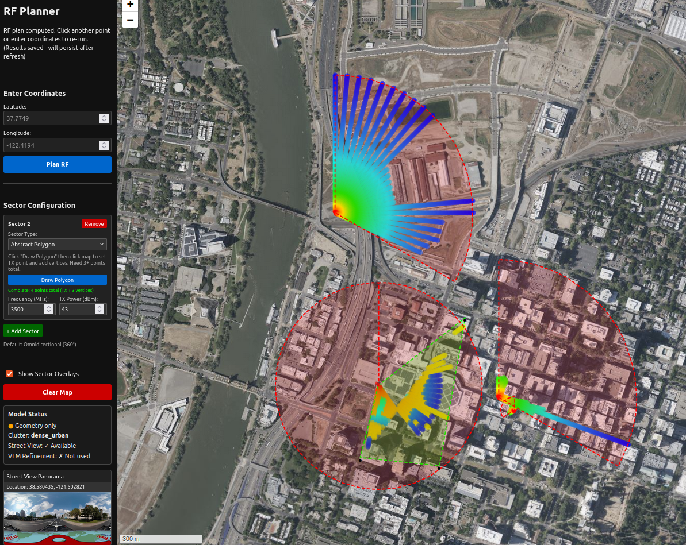

# ISAC RF Planner

Constructs a site-specific **RF digital twin** and runs **joint ISAC evaluation** for multiple waveforms on that same twin.

Supported illuminators include **5G NR** (sectorized and omnidirectional) and **digital television / DVT** broadcast (ATSC 1.0, ATSC 3.0, DVB-T, and related presets). Coverage planning and bistatic sensing products share one geometric world model.



## What it does

1. **Digital twin construction**: OSM buildings (optional terrain / 3D mesh), transmitter models, and RF parameters in one scene.
2. **Multi-waveform planning**: NR and DVT on that twin with waveform-appropriate antennas, power, and path-loss models.
3. **Joint ISAC evaluation**: communications coverage and sensing metrics (TX to target to analysis RX) without rebuilding the world per waveform.

Capability figures: **[docs/showcase/README.md](docs/showcase/README.md)**.

| Doc | Content |
| --- | --- |
| [DVT_SUPPORT.md](DVT_SUPPORT.md) | DVT / broadcast request schema and large-AOI planning |
| [ISAC_CHANNEL_ANALYSIS.md](ISAC_CHANNEL_ANALYSIS.md) | Bistatic / sensing analysis workflow |
| [examples/](examples/) | API payloads (`dvt_*.json`, `channel_analysis_*.json`) |
| [DEPENDENCIES.md](DEPENDENCIES.md) | Dependency and environment notes |

## Digital twin and propagation

- Obstacle geometry from OSM (cached / tileable for large radii), optional terrain and mesh
- Path-loss models including `3gpp_38901` and material / clutter attenuation
- 2D occlusion-aware and 3D mesh-oriented ray modes
- Exports: twin views, per-sector and per-TX heatmaps, ISAC product rasters, plan/sensing records

Optional street-level imagery and VLM material cues can refine local semantics. Geometry-only twins work without panorama API keys.

## Architecture

| Layer | Responsibility |
| --- | --- |
| **API** (`isac_rf_planner.api.rest`) | Plan and channel-analysis endpoints for NR and DVT |
| **RF** | Attenuation grids, sector and broadcast patterns, DVT ERP, ISAC products |
| **Geo** | OSM, coverage grids, heatmaps, geocoding, optional Street View |
| **Pipeline / agents** | Twin construction and plan orchestration |
| **UI** | 2D/3D map planner for siting, multi-waveform runs, and export |

Package: `src/isac_rf_planner/` (optional `src/isac_ue_planner/`).

## Installation

Python 3.8+. Project-local virtual environment:

```bash
git clone https://github.com/tiami-labs/isac-rf-planner.git
cd isac-rf-planner

python3 -m venv .venv
source .venv/bin/activate   # Windows: .venv\Scripts\activate

pip install -U pip
pip install -e .
```

CPU-only PyTorch (optional):

```bash
pip install torch torchvision torchaudio --index-url https://download.pytorch.org/whl/cpu
pip install -e .
```

See `requirements.txt`, `requirements-freeze.txt`, and [DEPENDENCIES.md](DEPENDENCIES.md). Config under `configs/`.

### Optional credentials

Copy [`.env.example`](.env.example):

| Variable | Purpose |
| --- | --- |
| `MAPILLARY_API_KEY` | Street View (optional) |
| `GOOGLE_MAPS_API_KEY` | Google elevation / tiles / 3D (optional) |

## Quick start

```bash
source .venv/bin/activate
uvicorn isac_rf_planner.api.rest:app --reload
```

Open `http://127.0.0.1:8000`. Build the twin, place NR and/or DVT transmitters, run coverage, enable bistatic channel analysis for ISAC products, export.

```bash
python -m isac_rf_planner.cli LAT LON \
  --config configs/default.yaml \
  --rf-config configs/rf.params.yaml
```

## Waveforms

**5G NR:** multi-site layouts; omni, angle, or polygon sectors; power, tilts, beamwidths, PCI; heatmap layers.

**DVT / broadcast:** one station and radiation system per plan; ERP or conducted power; large-radius OSM tiling ([DVT_SUPPORT.md](DVT_SUPPORT.md)).

**ISAC:** waveform-agnostic TX-target-RX evaluation on the twin ([ISAC_CHANNEL_ANALYSIS.md](ISAC_CHANNEL_ANALYSIS.md)).

## Device selection

`configs/default.yaml` uses `device: auto`. Override with `device: cpu` or `device: cuda`, or `TINY_VLM_360_DEVICE` for optional VLM paths.

## License

[MIT License](LICENSE). Copyright (c) 2025-2026 Tiami Labs.

API keys and proprietary map credentials are not included.
